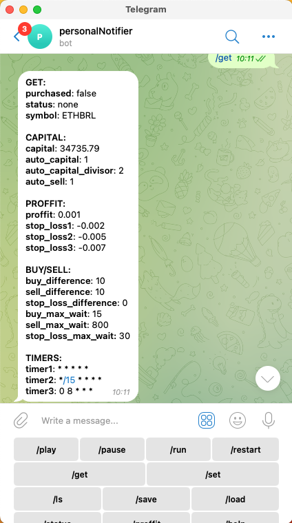
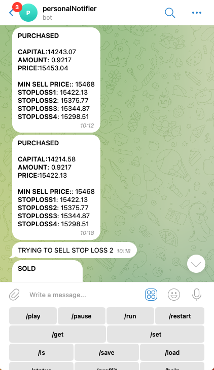
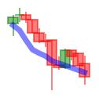
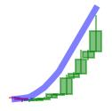

### BinanceBot (BIA) 

BIA it's a Binance BOT controlled by telegram that uses AI (Artificial Inteligence) to make predictions on price movements.

The BOT create buy or sell orders, it has a system of 4 stop loss levels, and it's totaly configured and personalized by telegram.

This it's not a guaranted investment and it's NOT an investment advice. USE IT AT YOUR OWN RISK. But if you win some money and would like to buy me a coffee.

### INSTALATION INSTRUCTIONS

Run install script, wich will create some folders.
./scripts/install.sh

``
cp .env.example .env
cd /bot
npm install
``

- Create your binance api key and secret
    - Remember to allow your IP ADDRESS to your binance API to create orders.
- Create a bot on Telegram using botfather.
    - The TELEGRAM_CHATID variable is your chat it with your bot, so the bot will only reply to you, and any other requests will be ignored.

### HOW AI WORKS

Before start to train a Convolutional Neural Network, first you need to create a
training dataset. 

As a starting point you can generate historical dataset and start training using this script:

``
cd /scripts
./train.sh
``

This script will generate an OHLC file in data/finance, will generate graphs bellow based on historical data.

#### BUY GRAPH

#### SELL GRAPH

The AI model is trained in Tensorflow, based on the images generated, and when the bot needs a decision if should buy or sell, just generates the actual graph and call the neural network to see the prediction.

